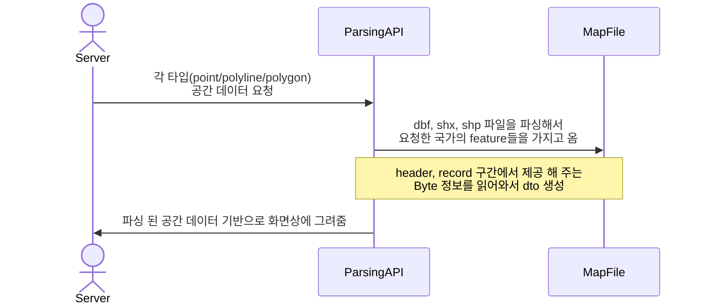

# mit_map_viewer project
(지도 데이터를 parsing하여 web 상에 표현 및 운영할 수 있도록 하는 viewer 프로젝트 입니다.)

## Environments
* Back-End
  * Amazon Corretto Version 17.0.7
  * Spring Boot 3.2.0
  * Gradle
  * lombok
  * webflux
  * caffein cache
* Front-End
  * html
  * thymeleaf
  * java script

## 프로젝트 패키지 구성
* src.main.java.com.tmap.mit.map_viewer
    * annotation (custom valid annotation 및 차후에 Redis cache 등을 aop 사용해서 annotation으로 제작 예정)  
    * cd (file 내에서 정의 된 code 값을 정의하고 검증 로직을 분리하기 위해서 생성)
    * config (application 내의 각종 설정이 추가 되어 있음 - 현재는 caffein cache 설정 되어 있음)
    * error (application에서 발생하는 error 처리)
    * constant (자주 사용되는 상수 설정 - 현재 shape file parsing 작업 중이라 이해하기 쉽도록 file 구조 기준으로 나누어 상수 정의)
    * feature (feature geometry, property를 가공하거나 데이터 호출)
    * init (기본 url 최초 접근에 대한 처리, cache에 application 실행 시점에 cache warm up을 하기 위한 작업 들어갈 예정인데 todo일뿐임)
    * shapefile (jts 라이브러리는 shapefile이 별도의 jar로 빠져있는 것 확인 용도가 명확해서 좋았음. 비슷한 아이디어로 분리함)
    * utils (application 내에서 공통으로 관리할 수 있는 기능들 정의)
* src.main.resource
    * files (kr, tr등 lang_culture 중 culture(country) 값을 기준으로 패키지를 나누어 각 국가별 shp/dbf/shx 파일이 존재하는 패키지)
    * js (view html 내에서 사용하는 js를 기능별로 나누어 관리하는 파일) 
    * templates (view html)
    * favicon.ico 존재 
* src.test.java.com.tmap.mit.map_viewer
    * controller (controller test code - BBD 형태)

## Process
### Map data parsing & Web Service


## 프로젝트 테스트 코드 구성 
1. MapDataControllerTest.class - 지도 데이터 추출 api 컨트롤러 테스트
    * givenFileName_whenGetMapDataByShapeFile_thenResponseCheck
      response status이 200인지 정도만 체크중임

## 공간 알고리즘 정리 
1. R-tree
2. Quadtree
3. K-d tree
4. Octree

## STRtree (Sort Tile Recursive Rtree 구현)
<예제> 
```Java
public class STRtreeExample {
    public static void main(String[] args) {
        STRtree strTree = new STRtree();

        // 예제 데이터
        strTree.insert(new Envelope(0, 0, 3, 3), "공간 1");
        strTree.insert(new Envelope(4, 2, 6, 5), "공간 2");
        strTree.insert(new Envelope(7, 5, 9, 9), "공간 3");

        // 쿼리 영역
        Envelope queryEnvelope = new Envelope(2, 2, 5, 5);

        // 쿼리 실행 및 결과 출력
        @SuppressWarnings("unchecked")
        List<String> queryResults = (List<String>) strTree.query(queryEnvelope);
        for (String result : queryResults) {
            System.out.println(result);
        }
    }
}
```

`queryEnvelope`에 의해 정의된 영역과 겹치는 사각형을 찾음.
공간 데이터를 인덱싱하여 특정 영역에 대해서 쿼리함.
<결과>
공간 1
공간 2


## 프로젝트 1차 회고 (진행 1주차)
1. QGIS 프로그램에서 세가지 파일(shp/dbf/shx)을 통해 읽어오는 정보들이 각각 어떤 데이터인지 대략적인 정보를 알게 됨
2. 현재 진행중인 shp 파일 파싱하여 view에 뿌려주는 작업을 통해서 어떤 데이터를 추출해야 view에서 유의미하게 사용할 수 있을지 알게됨.
3. shp 파일 구조에 대해서 이해하게 됨.
4. 현재 구조상 view에서 좌표 값 변환 작업을 하여 canvas에 맞춰진 지도 데이터를 뿌려주고 있는데 layer가 많아질수록 load 되는 시간이 늘어나 사용자 환경에 따라서 무거워질 것 같아 고민 필요
5. QGIS 상에서 제공하는 기능이 가능한지 여부는 앞으로 진행하면서 계속적으로 고민 예정

## 프로젝트 1차 피드백
1. QGIS 밴치마킹 많이 해볼 것
2. 파일 크기가 mb단위이다. 이런 상황에서 파일을 읽는 작업을 어떻게 효율화를 할 수 있는가?
3. 비슷한 용어들을 찾아보고 모두 이해할 수 있도록 하자.

## 프로젝트 N차 회고 (2024.02.01)
1. buffer를 가지고 교차 지점을 찾아 property를 뿌려줄 때 어떻게 처리를 하는것이 좋은가?
2. 각 공간 알고리즘이 무엇이 있고 어떻게 활용이 되고 있는가? 

## 프로젝트 N차 피드백
1. 
