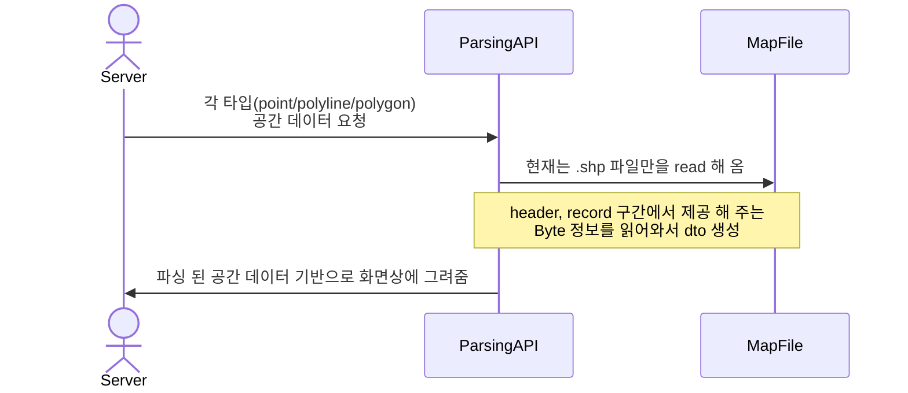

# mit_map_viewer project
(지도 데이터를 parsing하여 web 상에 표현 및 운영할 수 있도록 하는 viewer 프로젝트 입니다.)

## Environments
* Back-End
  * Amazon Corretto Version 17.0.7
  * Spring Boot 3.2.0
  * Gradle
  * lombok
  * webflux
* Front-End
  * html
  * java script

## 프로젝트 패키지 구성
* src.main.java.com.tmap.mit.map_viewer
    * cd (file 내에서 정의 된 code 값을 정의하고 검증 로직을 분리하기 위해서 생성)
    * config (todo - cache 처리 등 어플리케이션 고도화에 필요한 config 추가 예정)
    * constant (자주 사용되는 상수 설정 - 현재 shape file parsing 작업 중이라 이해하기 쉽도록 file 구조 기준으로 나누어 상수 정의)
    * controller (view를 return하거나 api 형태로 지도 데이터 추출 데이터를 전달하는 기능 정의)
    * dto (view로 넘겨주는 지도 데이터 중 유의미한 데이터 기준으로 dto 정의)
    * error (todo - 향후에 공통화된 error 처리 추가 예정)
    * service (실제로 지도 데이터를 추출하는 기능)
* src.main.resource
    * files (shp/dbf/shx 파일이 존재하는 패키지)
    * templates (view html)
* src.test.java.com.tmap.mit.map_viewer
    * controller (controller test code - BBD 형태)

## Process
### Map data parsing & Web Service

## 프로젝트 테스트 코드 구성 
1. MapDataControllerTest.class - 지도 데이터 추출 api 컨트롤러 테스트
    * givenFileName_whenGetMapDataByShapeFile_thenResponseCheck
      
      response status이 200인지 정도만 체크중임
      

## 프로젝트 1차 회고 (진행 1주차)
1. QGIS 프로그램에서 세가지 파일(shp/dbf/shx)을 통해 읽어오는 정보들이 각각 어떤 데이터인지 대략적인 정보를 알게 됨
2. 현재 진행중인 shp 파일 파싱하여 view에 뿌려주는 작업을 통해서 어떤 데이터를 추출해야 view에서 유의미하게 사용할 수 있을지 알게됨.
3. shp 파일 구조에 대해서 이해하게 됨.
4. 현재 구조상 view에서 좌표 값 변환 작업을 하여 canvas에 맞춰진 지도 데이터를 뿌려주고 있는데 layer가 많아질수록 load 되는 시간이 늘어나 사용자 환경에 따라서 무거워질 것 같아 고민 필요
5. QGIS 상에서 제공하는 기능이 가능한지 여부는 앞으로 진행하면서 계속적으로 고민 예정

## 프로젝트 1차 
1. QGIS 밴치마킹 많이 해볼 것
2. 파일 크기가 mb단위이다. 이런 상황에서 파일을 읽는 작업을 어떻게 효율화를 할 수 있는가? 

      

